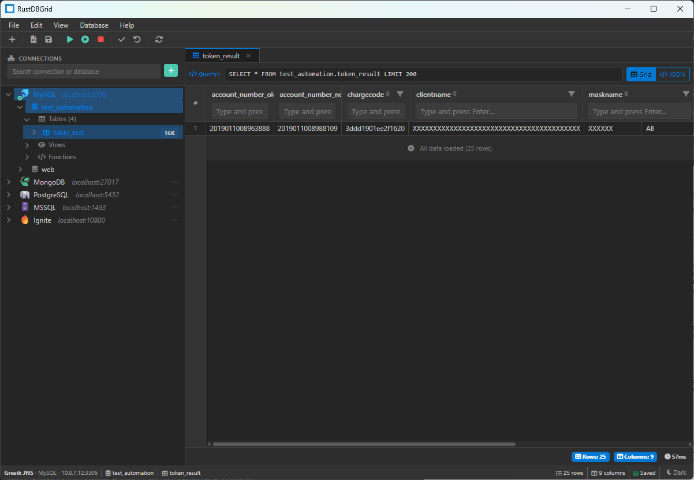

# RustDBGrid

[](https://github.com/rajebdev/rustdbgrid/actions/workflows/ci.yml)
[](https://github.com/rajebdev/rustdbgrid/actions/workflows/build.yml)
[](https://opensource.org/licenses/MIT)

A modern, cross-platform database manager built with **Rust**, **Tauri 2.0**, and **Svelte**. Manage multiple database types from a single, fast, and lightweight desktop application.



## ✨ Features

- 🗄️ **Multi-database support**: MySQL, PostgreSQL, SQLite, SQL Server, MongoDB, Redis, Apache Ignite
- 📝 **SQL Editor**: Execute queries with syntax highlighting (CodeMirror)
- 📊 **Data Grid**: View and explore query results in a responsive table
- 🌲 **Schema Explorer**: Browse databases, schemas, tables, and columns
- 🎨 **Dark/Light Theme**: Comfortable viewing in any environment
- ⌨️ **Keyboard Shortcuts**: Boost productivity with hotkeys
- 💾 **Export**: Export schema and data (coming soon)
- 🖥️ **Cross-platform**: Windows, Linux, and macOS

## 📦 Download

Download the latest release for your platform:

| Platform | Download |
|----------|----------|
| Windows | [.exe / .msi](https://github.com/rajebdev/rustdbgrid/releases/latest) |
| Linux | [.deb / .AppImage](https://github.com/rajebdev/rustdbgrid/releases/latest) |
| macOS Intel | [.dmg](https://github.com/rajebdev/rustdbgrid/releases/latest) |
| macOS Apple Silicon | [.dmg](https://github.com/rajebdev/rustdbgrid/releases/latest) |

## 🛠️ Tech Stack

| Layer | Technology |
|-------|------------|
| **Backend** | Rust, Tauri 2.0 |
| **Frontend** | Svelte 4, Bootstrap 5, CodeMirror 6 |
| **Database Drivers** | sqlx, mongodb, redis, tiberius, ignite-rs |
| **Build** | Vite, esbuild |

## 🚀 Getting Started

### Prerequisites

- [Rust](https://rustup.rs/) (latest stable)
- [Node.js](https://nodejs.org/) 18+ and npm
- Platform-specific dependencies:
  - **Windows**: WebView2 (usually pre-installed on Windows 10/11)
  - **Linux**: `libwebkit2gtk-4.1-dev`, `libayatana-appindicator3-dev`
  - **macOS**: Xcode Command Line Tools

### Installation

```bash
# Clone the repository
git clone https://github.com/rajebdev/rustdbgrid.git
cd rustdbgrid

# Install dependencies
npm install

# Run in development mode
npm run tauri dev
```

### Build for Production

```bash
npm run tauri build
```

The built application will be in `src-tauri/target/release/bundle/`.

## 📁 Project Structure

```
rustdbgrid/
├── src/                    # Svelte frontend
│   ├── components/         # UI components
│   │   ├── common/         # DataGrid, SqlEditor, etc.
│   │   ├── layout/         # MainLayout, MenuBar, StatusBar
│   │   ├── modals/         # Connection, Filter, About modals
│   │   └── context-menus/  # Right-click context menus
│   ├── stores/             # Svelte stores (state management)
│   ├── services/           # App services (theme, file, etc.)
│   └── App.svelte          # Main app component
├── src-tauri/              # Rust backend
│   ├── src/
│   │   ├── commands/       # Tauri IPC commands
│   │   ├── db/             # Database drivers & connection pool
│   │   ├── models/         # Data structures
│   │   └── main.rs         # Entry point
│   └── Cargo.toml          # Rust dependencies
├── src-bridge/             # Node.js sidecar for Apache Ignite
└── package.json            # Node dependencies
```

## 🗄️ Supported Databases

| Database | Status | Features |
|----------|--------|----------|
| MySQL | ✅ Ready | Query, Schema Browse |
| PostgreSQL | ✅ Ready | Query, Schema Browse |
| SQLite | ✅ Ready | Query, Schema Browse |
| SQL Server | ✅ Ready | Query, Schema Browse |
| MongoDB | 🚧 Basic | Connect, Query |
| Redis | 🚧 Basic | Connect, Commands |
| Apache Ignite | 🚧 Basic | Connect via Bridge |

## ⌨️ Keyboard Shortcuts

| Shortcut | Action |
|----------|--------|
| `Ctrl/Cmd + Enter` | Execute query |
| `Ctrl/Cmd + S` | Save |
| `Ctrl/Cmd + N` | New connection |
| `Ctrl/Cmd + W` | Close tab |
| `F5` | Refresh |

## 🤝 Contributing

Contributions are welcome! Please feel free to submit a Pull Request.

1. Fork the repository
2. Create your feature branch (`git checkout -b feature/amazing-feature`)
3. Commit your changes (`git commit -m 'Add some amazing feature'`)
4. Push to the branch (`git push origin feature/amazing-feature`)
5. Open a Pull Request

## 📄 License

This project is licensed under the MIT License - see the [LICENSE](LICENSE) file for details.

## 🙏 Acknowledgments

- [Tauri](https://tauri.app/) - Build smaller, faster, and more secure desktop apps
- [Svelte](https://svelte.dev/) - Cybernetically enhanced web apps
- [CodeMirror](https://codemirror.net/) - Versatile text editor for the browser
- [Bootstrap](https://getbootstrap.com/) - The world's most popular front-end toolkit

